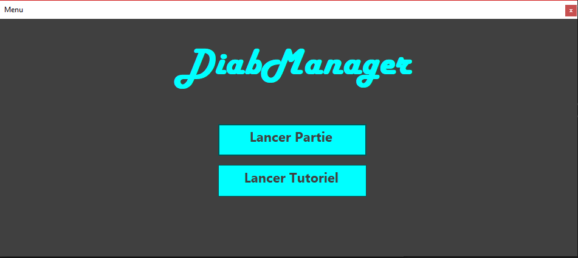
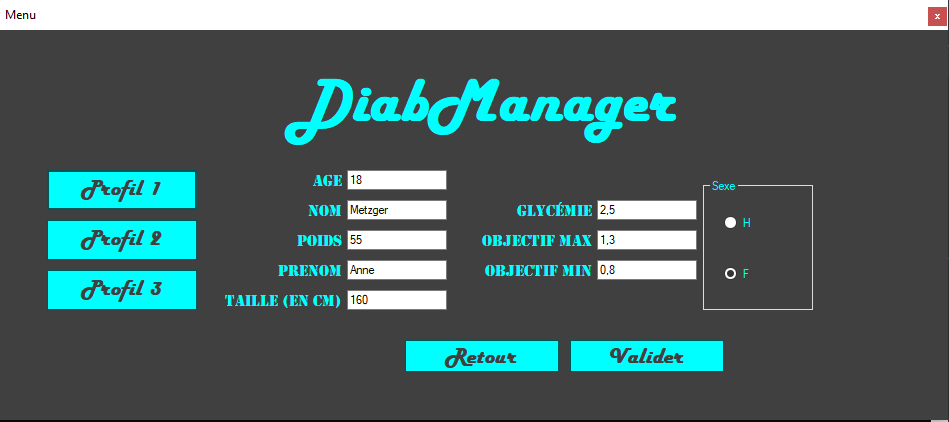
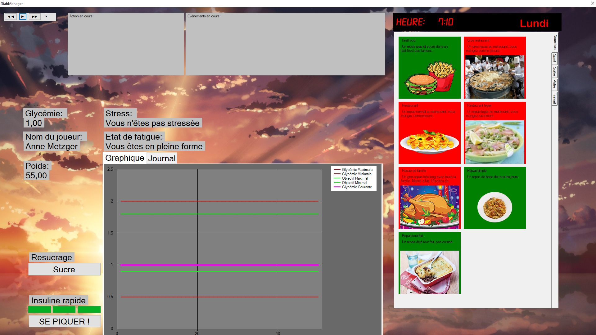

# DiabManager

## Présentation 
Vous allez chez le médecin ce matin et vous êtes diagnostiqué diabétique. Vous allez devoir changer votre vie et vous habituez à contrôler votre glycémie. 
Vous aurez plusieurs choix possibles durant la journée, et certaines choses imprévues vous arriveront. 
Attention à bien respecter les doses prescrites pour éviter des complications, voir la mort !

---

## Informations générales
L'objectif du jeu est de garder le taux de glycémie de votre joueur entre deux bornes pendant plus de trois jours 
(quelques écarts sont acceptables, mais dans l'ensemble les valeurs ne doivent pas sortir de l'intervalle) sans sortir des valeurs extremes (qui correspondent à l'hyperglycémie et l'hypoglycémie). 
Plusieurs facteurs vont faire bouger le taux de glycémie de votre joueur, comme vos choix (faire du sport, manger, faire un resucrage, ...) 
et il vous faudra prendre les bonnes décisions afin qu'il soit en bonne santé.

---

## Astuces
Les différentes actions ne sont pas forcément toutes utilisables à n'importe quelle heure, par exemple il est impossible d'aller chez 
le médecin un dimanche ou à 23h ! Les actions non  disponibles sont en rouge, tandis que celles disponibles sont en vert. 
Des évènements aléatoires peuvent vous arriver à n'importe quel moment, il faudra faire attention à leur impact sur le taux de glycémie de votre joueur. 
Vous avez la possibilité de vous resucrer si votre taux de glycémie est anormalement bas et que vous ne pouvez pas vous nourrir par exemple. 
Certains évènements aléatoires peuvent vous indiquer une situation anormale dans la santé de votre joueur, par exemple les nausées, faiblesses ou alors le besoin d'uriner très souvent.

---

## Installation
Pour installer le jeu, téléchargez l'installeur (disponible dans la section en dessous), et double-cliquez sur l'installeur. 
Laissez-vous guider pour l'installation.  
Une fois que le jeu est installé, vous pouvez le démarrer en double-cliquant sur le nom du jeu (sur le bureau ou dans le menu de votre ordinateur).

---

## Récupérer le projet
Prérequis:
 - Visual Studio avec C# [disponible ici](https://visualstudio.microsoft.com/fr/downloads/).
 - Le framework .NET 4.7 [disponible ici](https://www.microsoft.com/fr-fr/download/details.aspx?id=55167).

Pour récupérer le projet, téléchargez l'archive (ou clonez-la avec GIT), puis dirigez-vous dans le dossier DiabManager/.  
Ensuite, lancez le fichier DiabManager.sln avec Visual Studio.

---

## Liens
- [Téléchargement](https://git.unistra.fr/T432_SPA18_T3_B/T432_SPA18_T3_B/blob/master/DiabManagerSetup.exe "Lien de téléchargement")
- [Doc (disponible depuis l'IUT)](https://webetu.iutrs.unistra.fr/~gkugelmann/T3/doc/ "Lien de doc")
- [Notre CDCF](https://docs.google.com/document/d/1cVAyEzOS9O1DJjmaP3hkC2fDr3x8sC2kWvRtWae6wbE "Cahier des charges")
- [Notre répartition des tâches](https://docs.google.com/spreadsheets/d/1MUhy42l2Raar1IHmeH0sRpqbUxsurJD8HO2RxUYNQFs "Répartition des tâches")

---

